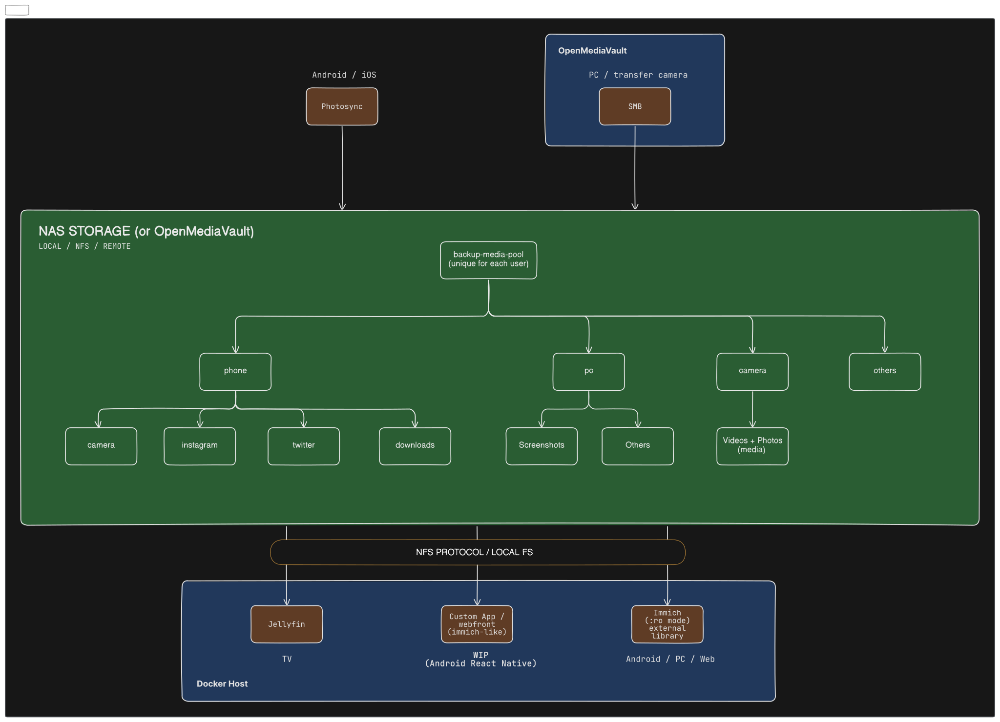

# Backup Storage template

## Why not nextcloud?
- Its cumbersome, and sometimes break.

## Docker Compose files:
- [Only Jellyfin](./compose_jellyfin_only/docker-compose.yml)

## Features:
- accesible from TV (via jellyfin)
- Easy upload from PC (via SMB)
- Easy access to phone (via immich or Owlfiles)
- Easy upload from phone (via photosync)
- Easy to backup, just save the source directory (pool)
- easy to host, via OpenMediaVault
- much better previewing, via linux's gnome-sushi
- Album generation using immich if needed

## Steps
On OpenMediaVault:
    - Create a share on OpenMediaVault
    - Make it a Samba and an NFS share
On Docker Host:
    - Now mount the NFS share on you Docker host machine, to a folder
    - Run the `make_template_pool.sh` script to create the pool according to template into the mounted folder
    - now modify the `base_path` env parameter for the docker-compose.yml
    - change the `port`, all the containers are reverse proxied.
    - check the uid:gid if needed, in the docker-compose.yml
    - Start the docker compose

> Repeat this for each user. (unique ports for each)

## A note:
- If a folder is missing, for example `music` folder has not yet been created on the nfs mount, starting docker will be unable to autocreate that folder, as the the Host OS user has no permission to create the folder, but the container inside can, since it has the necessary permission. i passed uid, gid to that.
- So just manually create the folder, and `change the ownership`

- (OR)
- just add no_root_squash (to nfs)

